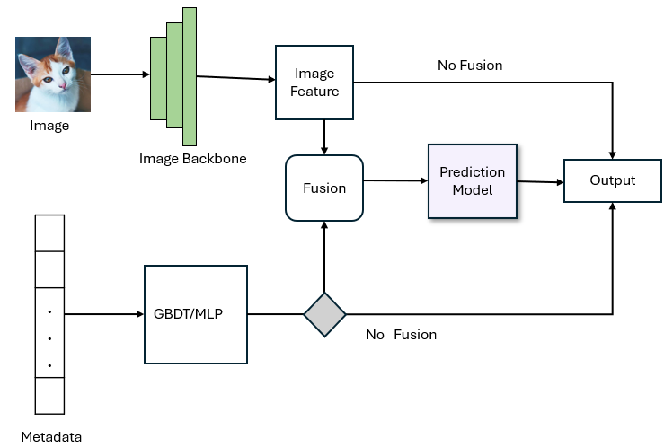
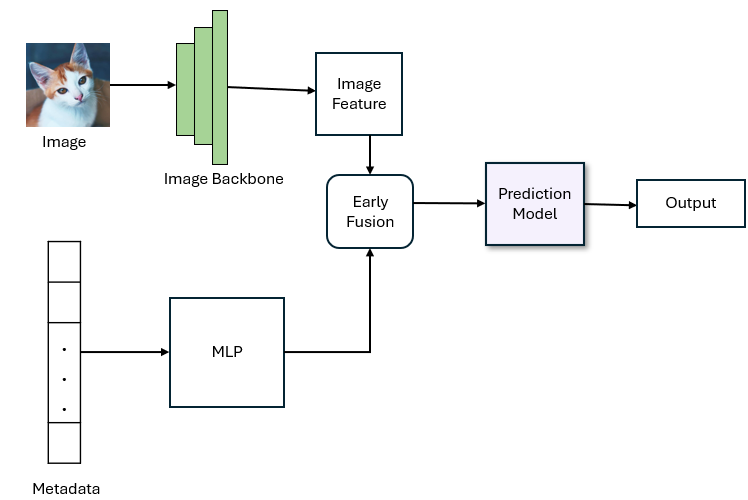
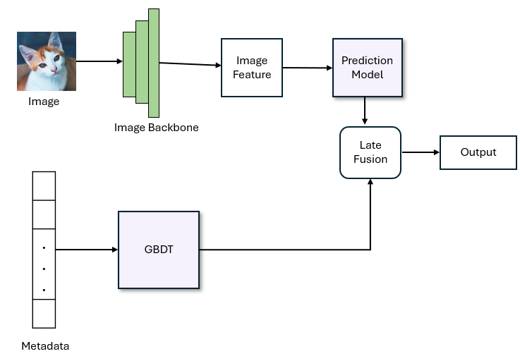

# Pawpularity Prediction Experiments

This project explores which pipeline components contribute most to Pawpularity prediction performance.  
We run controlled experiments across image backbones, metadata models, fusion strategies, and ensembles.
The main flow of each experiment is inside the notebooks folder

## Pipeline Stages
1. Image input & augmentation  
2. Vision backbone (EfficientNet, Swin)  
3. Tabular metadata model (MLP, LightGBM/XGBoost)  
4. Fusion (early vs late)  
5. Prediction head (linear vs MLP)  
6. Ensemble (single, multi, stacking)

## Experiments
- Exp0: Baseline Ridge fusion  
- Exp1: Tabular-only (GBDT)  
- Exp2–3: CNN / Swin only  
- Exp4–5: Early fusion  
- Exp6–7: Late fusion  
- Exp8–11: High-res + ensembles

## Graphs
- Figure 1: Pipeline

- Figure 2: Early Fusion

- Figure 3: Late Fusion

## Folder structure

Poject layout:

Pawpularity-Prediction-Experiments/
- data/
  - train.csv
  - train/              # training images
- graphs/
  - *.pptx # Three figures PPTX files
  - *.pdf # Three figures PDF files
- notebooks/
  - exp0.ipynb          # main flow of exp0
  - exp1.ipynb
  - exp2.ipynb
  - exp3.ipynb

- src/
  - config.py
  - data.py
  - models.py
  - plot.py
  - utils.py  
- README.md
